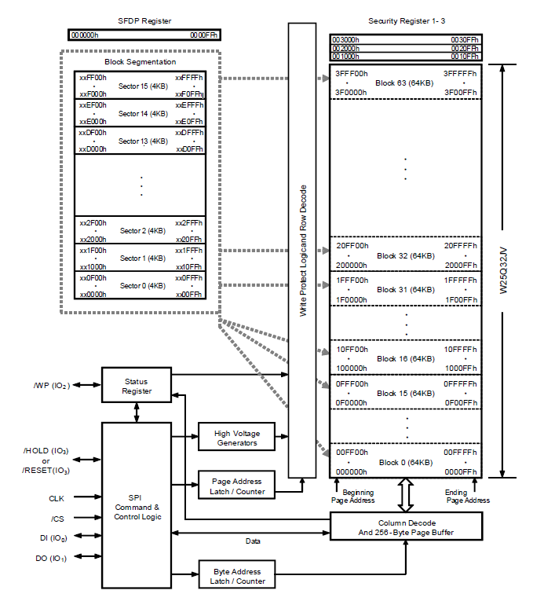

# README

w25qxx.c

w25qxx.h

这两个文件包含初始化及使用的所有api

只需要配置好spi和cs在mxcube



## 关键函数

```
void W25Q32_PageWrite(uint8_t block, uint8_t sector, uint8_t page, uint8_t innerAddr, uint8_t *data, uint16_t len);
```

写入具体到页内地址
