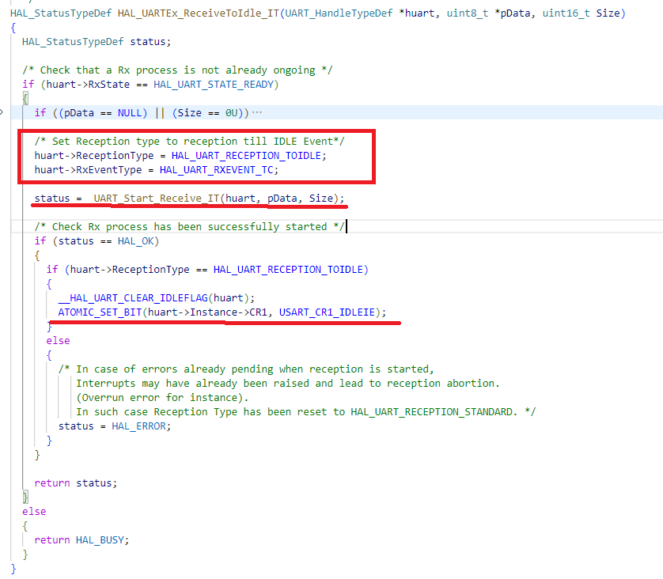

# STM32 UART中断接收变长数据--笔记----为什么要反复调用HAL_UARTEx_ReceiveToIdle_IT(&huart1, rxBuffer, 20)

## 1.UART如何接收变长数据

当接收完毕后，RX引脚会一直维持高电平，只要高电平保持超过10的波特率周期时间（大概原理，实际可能不是这样），IDLE标志位就会被置为1（IDLEIE被使能的情况下）。我们只要打开RX_NE(接收非空)和IDLE（空闲）中断，编写中断逻辑，就能实现。

### 中断函数逻辑（伪代码）

```c
#define MAX 100
uint_8 buf[MAX];
void IRQ(void){
	if(SR & RX_NE != 0){
        buf[count] = DR;//此操作本身就可以清除中断标志
        count++;
    }else if(SR & IDLE != 0)
    {
        clear;			//清除中断标志
    }

}
```

## 2.HAL中的函数实现逻辑

### 2.1在UART_Init中配置好中断，开启UART的全局中断

```c
    /* USART1 interrupt Init */
    HAL_NVIC_SetPriority(USART1_IRQn, 0, 0);
    HAL_NVIC_EnableIRQ(USART1_IRQn);
```

### 2.2调用HAL_UARTEx_ReceiveToIdle_IT,开启局部中断



就是开启了RX_NE和IDLE的局部中断

### 2.3在stm32f1xx_it.c配置中断回调函数

```C
void USART1_IRQHandler(void)
{
  /* USER CODE BEGIN USART1_IRQn 0 */

  /* USER CODE END USART1_IRQn 0 */
  HAL_UART_IRQHandler(&huart1);
  /* USER CODE BEGIN USART1_IRQn 1 */

  /* USER CODE END USART1_IRQn 1 */
}

/* USER CODE BEGIN 1 */
void HAL_UARTEx_RxEventCallback(UART_HandleTypeDef *huart, uint16_t Size)
{
  begin = 1;
}
/* USER CODE END 1 */
```

### 2.4主函数

```C
int main(){
    uint8_ begin = 0;
while (1)
  {
    /* USER CODE END WHILE */
    HAL_UARTEx_ReceiveToIdle_IT(&huart1, rxBuffer, 20);
    if(begin){
      HAL_Delay(1000);
      printf("recv: %s count: %d\r\n", rxBuffer);
      begin = 0;

      memset(rxBuffer, 0, 20);
    }
    /* USER CODE BEGIN 3 */
  }
  /* USER CODE END 3 */
}
}
```

## 3为什么要反复调用HAL_UARTEx_ReceiveToIdle_IT(&huart1, rxBuffer, 20)

### 简单回答

因为在HAL的UART_IRQ内,当IDLE中断处理逻辑中，它会清空UART那两个中断的使能。具体可以跳进去看源码。

## 4建议

### 1.重写回调函数，在回调函数内书写逻辑而不是在USART1_IRQHandler(void)，这样可以避免一些错误

### 2.加上判断中断标志位或类似方式，避免硬件问题导致误触发中断

```C
void USART1_IRQHandler(void)
{
  /* USER CODE BEGIN USART1_IRQn 0 */

  /* USER CODE END USART1_IRQn 0 */
  HAL_UART_IRQHandler(&huart1);
  /* USER CODE BEGIN USART1_IRQn 1 */

  /* USER CODE END USART1_IRQn 1 */
}

/* USER CODE BEGIN 1 */
void HAL_UARTEx_RxEventCallback(UART_HandleTypeDef *huart, uint16_t Size)
{
    if (huart1.Instance == USART1)
    { 
          begin = 1;
    }
}
/* USER CODE END 1 */
```

